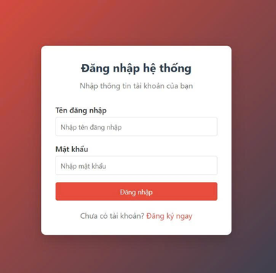
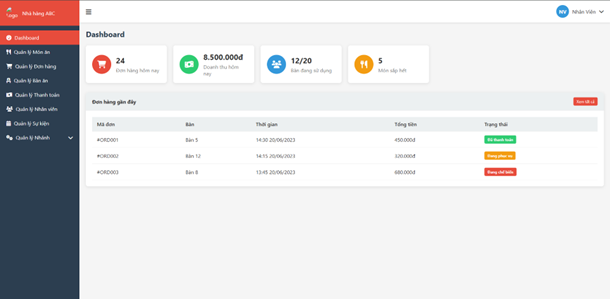
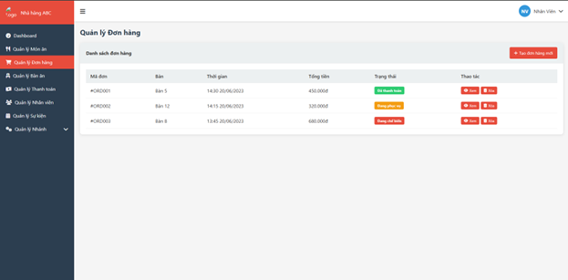
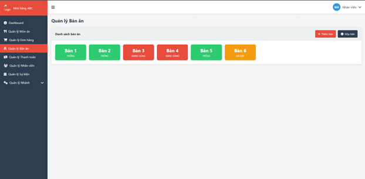
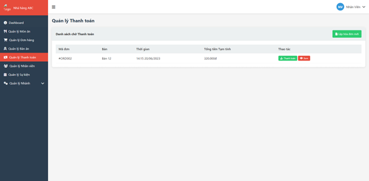
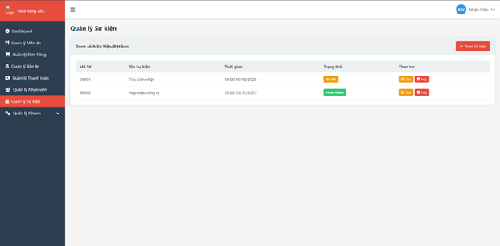
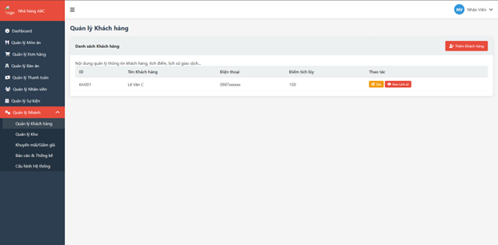

# Quản Lý Quán Ăn
# 1. Giới thiệu
Hệ thống quản lý quán ăn là một ứng dụng phần mềm hỗ trợ số hóa toàn bộ hoạt động vận hành trong quán, từ quản lý món ăn, đơn hàng, bàn ăn cho đến nhân viên và khách đặt bàn. Hệ thống được xây dựng trên nền tảng web, giao tiếp thông qua API backend nhằm đảm bảo xử lý dữ liệu nhanh và chính xác. Nhờ tự động hóa quy trình, hệ thống giúp giảm sai sót, tăng hiệu quả phục vụ và tối ưu hóa quản lý. Đây là giải pháp hiện đại phù hợp với mô hình quán ăn muốn vận hành chuyên nghiệp và thông minh hơn.
# 2. Các công nghệ được sử dụng
  + Hệ điều hành windown
  + HTML/CSS/JAVASCRIPT
# 3. Hình ảnh các chức năng
  + Đăng ký/ Đăng nhập
  
  + Trang chủ
  
  + Quản lý món ăn & menu
  
  + Quản lý đơn hàng
  
  + Quản lý bàn ăn
  
  + Quản lý thanh toán
  
  + Quản lý nhân viên
  
  + Quản lý sự kiện
  
  + Quản lý khách hàng
  
  + Chức năng mở rộng
  
